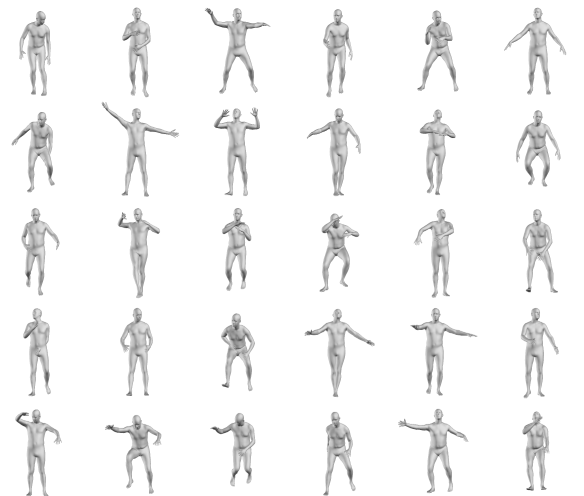

# Body Visualizer

## Description
Set of tools to visualize and render SMPL family body parameters.

## Table of Contents
  * [Description](#description)
  * [Installation](#installation)
  * [Tutorials](#tutorials)
  * [Contact](#contact)

## Installation
This repository now ships a `pyproject.toml` that is consumed by [`uv`](https://github.com/astral-sh/uv), and the legacy `setup.py` / `requirements.txt` pair has been removed.

### Requirements
- Python 3.11–3.12 (PyTorch doesn't publish Windows wheels for newer CPython releases yet)
- [`uv`](https://docs.astral.sh/uv/getting-started/installation/) (manages the virtual environment and lock file)
- [Human Body Prior](https://github.com/nghorbani/human_body_prior) runtime assets

### Sync the environment
From the repository root run:
```bash
uv sync
```
This creates/updates `.venv` and installs the minimal runtime dependencies defined in `pyproject.toml`. Developers can pull in linting and testing tools (Ruff, pytest, coverage, mypy) with:
```bash
uv sync --extra dev
```
Run Ruff via:
```bash
uv run ruff check .
uv run ruff format --select I  # optional: import re-ordering only
```

### Install the package
`uv pip install .` will install the library into your active environment. Extras are available for optional features, for example:
```bash
uv pip install ".[pl]"     # add Lightning integrations on top of extras
uv pip install ".[psbody]"     # psbody.mesh git bindings (Linux-friendly wheels only)
```
`pytorch3d` remains opt-in and is intentionally not part of any default extra. The `psbody` extra fetches the legacy `psbody-mesh` repository from GitHub (via `psbody-mesh @ git+https://github.com/MPI-IS/mesh.git@v0.4`), which typically publishes Linux wheels; plan accordingly if you are on Windows or macOS. If you previously synced an environment using the old package name, run `uv lock --rebuild` (or delete `uv.lock`) before installing the extras to refresh the dependency graph.

### CUDA note
The core dependency list tracks the CPU-only PyTorch wheel (`torch>=2.5,<2.6`). Install the GPU build that matches your CUDA toolkit when needed:
```bash
# Example for CUDA 12.4 users
uv pip install --index-url https://download.pytorch.org/whl/cu124 "torch==2.5.1+cu124" --no-deps
```
Repeat the command with the appropriate index URL/version for your platform as documented on [pytorch.org](https://pytorch.org/get-started/locally/).

## Usage
For sample code refer to [VPoser repo](https://github.com/nghorbani/human_body_prior)

## License
Software Copyright License for **non-commercial scientific research purposes**.
Please read carefully the [terms and conditions](./LICENSE) and any accompanying documentation before you download and/or 
use the SMPL-X/SMPLify-X model, data and software, (the "Model & Software"), 
including 3D meshes, blend weights, blend shapes, textures, software, scripts, and animations. 
By downloading and/or using the Model & Software (including downloading, cloning, installing, 
and any other use of this github repository), you acknowledge that you have read these terms and conditions, 
understand them, and agree to be bound by them. If you do not agree with these terms and conditions, 
you must not download and/or use the Model & Software. Any infringement of the terms of this agreement 
will automatically terminate your rights under this [License](./LICENSE).

## Contact
The code in this repository is developed by [Nima Ghorbani](https://nghorbani.github.io/).
